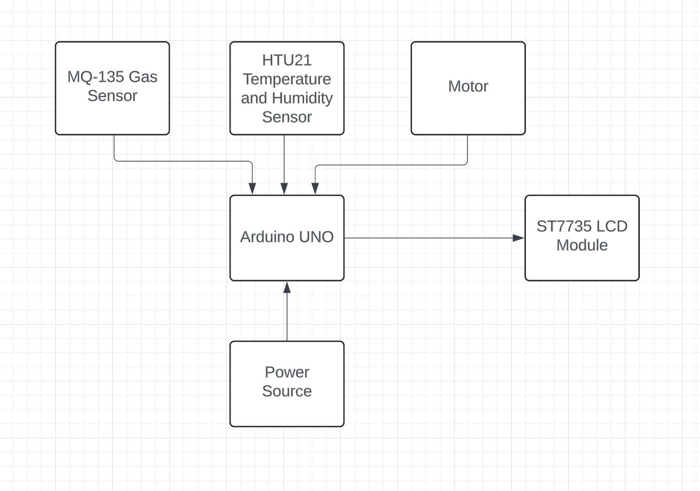
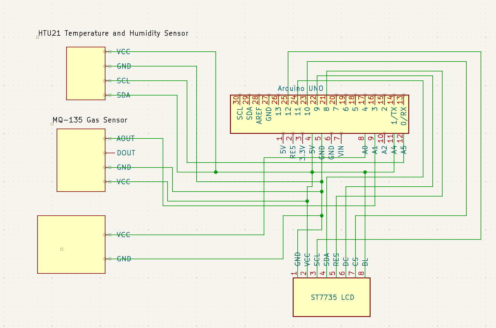

# Your Project Name

| | |
|-|-|
|`Author` | Pascu Mihai-Alexandru

## Description

It is a small weather station that offers features such as measuring  temperature, humidity, wind speed and air quality by using integrated sensors and a motor.

## Motivation

Ease the access to relevant weather information.

## Architecture

### Block diagram

<!-- Make sure the path to the picture is correct -->

### Schematic

### Components

<!-- This is just an example, fill in with your actual components -->

| Device | Usage | Price |
|--------|--------|-------|
| Arduino UNO | Microcontroller | [34.50 RON](https://www.optimusdigital.ro/ro/placi-avr/1685-uno-r3-atmega328p-atmega16u2-placa-de-dezvoltare-compatibila-cu-arduino.html?search_query=arduino+uno&results=138) |
| HTU21 | Measure Temperature And Humidity | [15 RON](https://www.optimusdigital.ro/ro/senzori/12961-senzor-de-temperatura-si-umiditate-htu21.html) |
| Modul LCD | Display Weather Information | [30 RON](https://www.optimusdigital.ro/ro/optoelectronice-lcd-uri/1312-modul-lcd-spi-de-144-128x128-ili9163-negru.html) |
| Gas sensor | Measure Air Quality | [12 RON](https://www.optimusdigital.ro/ro/senzori-de-gaze/1128-modul-senzor-de-gaz-mq-135.html) |
| Breadboard | Ease Connection Of Devices | [9.98 RON](https://www.optimusdigital.ro/ro/prototipare-breadboard-uri/8-breadboard-830-points.html?search_query=breadboard&results=151) |
| Motor | Measure wind speed | [9.99 RON](https://www.optimusdigital.ro/ro/motoare-altele/2354-motor-de-mare-viteza-coreless-4-x-8-mm-70000-rpm-la-3-v.html?search_query=motor+70000&results=1) |
| Male-Female Jumper cables | Connect Devices | [4.5 RON](https://www.optimusdigital.ro/ro/toate-produsele/876-set-fire-mama-tata-10p-15-cm.html) |
| Female-Female Jumper cables | Connect Devices | [6.99 RON](https://www.optimusdigital.ro/ro/fire-fire-mufate/881-set-fire-mama-mama-40p-15-cm.html?search_query=jumper+wire&results=13) |

### Libraries

<!-- This is just an example, fill in the table with your actual components -->

| Library | Description | Usage |
|---------|-------------|-------|
| [Adafruit Sensor](https://github.com/adafruit/Adafruit_Sensor) | Provides a unified sensor interface | |
| [Adafruit HTU21DF](https://github.com/adafruit/Adafruit_HTU21DF_Library) | Interfaces with the HTU21DF temperature and humidity sensor |   |
| [Adafruit GFX](https://github.com/adafruit/Adafruit-GFX-Library) | Core graphics library for displays |   |
| [Adafruit ST7735](https://github.com/adafruit/Adafruit-ST7735-Library) | Drives the ST7735 LCD display |   |
| [SPI](https://www.arduino.cc/reference/en/language/functions/communication/spi/) | Enables SPI communication |   |

## Log

<!-- write every week your progress here -->

### Week 6 - 12 May

### Week 7 - 19 May

### Week 20 - 26 May

## Reference links

<!-- Fill in with appropriate links and link titles -->

[MQ-135 Sensor Tutorial](https://www.youtube.com/watch?v=Ku4Y29XPyyo)
[LCD Tutorial](https://www.youtube.com/watch?v=-nECx4DOE84)

## Proof

## Code

